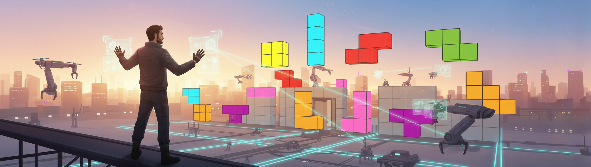
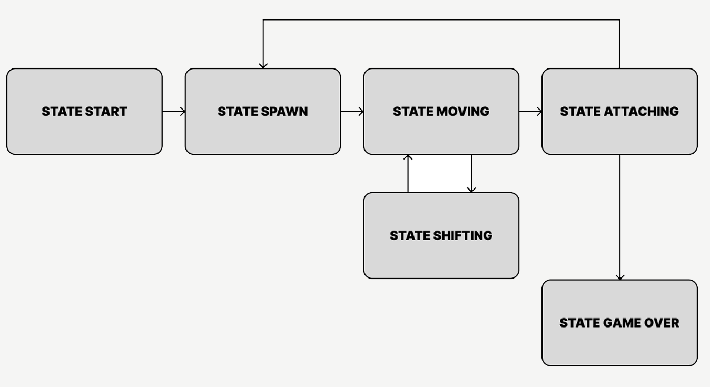

# 🕹️ Brick Game

-violet)
[](https://github.com/Mikle024/C7_BrickGame/actions/workflows/ci.yml)

*The project was written from task S21.* 



Это реализация классической игры **"Тетрис"** с использованием языка программирования **C** и библиотеки **ncurses** для создания интерфейса с использованием псевдографики. Проект демонстрирует навыки работы с конечными автоматами, обработкой пользовательского ввода и созданием игровой логики.


## 🏗️ Архитектура FSM



*Подробнее в документации (генерация с помощью цели `make dvi`)*

### 🔹 Требования к системе

Для запуска проекта необходимы следующие компоненты:

- [GIT](https://git-scm.com/) - система контроля версий
- [GCC](https://gcc.gnu.org/) - компилятор C
- [Make](https://www.gnu.org/software/make/) - система сборки
- [ncurses](https://invisible-island.net/ncurses/) - библиотека для создания псевдографического интерфейса

### 🔹 Установка и запуск

1. Склонируйте репозиторий:
```bash
git clone git@github.com:Mikle024/C7_BrickGame.git
```

2. Перейдите в директорию проекта:
```bash
cd C7_BrickGame
```

3. Соберите проект:
```bash
cd src
make install
```

4. Запустите игру:
```bash
cd ../build
./s21_BrickGame
```

---

### 🔹 Управление и механики

- **Стрелка влево** - перемещение фигуры влево
- **Стрелка вправо** - перемещение фигуры вправо
- **Стрелка вниз** - ускорение падения фигуры
- **R** - поворот фигуры
- **P** - пауза
- **Q** - выход из игры

---

**В игре реализованы следующие механики**:

1. Подсчет очков

*Начисление очков будет происходить следующим образом:*

1 линия — 100 очков;

2 линии — 300 очков;

3 линии — 700 очков;

4 линии — 1500 очков.

---

2. Хранение максимального количества очков

*Максимальный рекорд записывается в файл `highScore.txt` (создается автоматически при его отсутствии).*

---

3. Механика уровней

*Каждый раз, когда игрок набирает 600 очков, уровень увеличивается на 1. Повышение уровня увеличивает скорость движения фигур.*

*Максимальное количество уровней — 10.*

---

### 🔹 Сборка проекта

Проект использует **Makefile** для сборки. Доступные команды (из директории `src/`):

- `make install` - сборка и установка игры
- `make uninstall` - удаление установленной игры
- `make clean` - очистка временных файлов
- `make rebuild` - пересборка проекта
- `make test` - запуск тестов
- `make gcov_report` - генерация отчета о покрытии кода тестами
- `make style_check` - проверка форматирования кода
- `make format_style` - форматирование кода
- `make dvi` - генерация документации
- `make dist` - создание дистрибутива

### 🔹 Тестирование

Для запуска тестов используйте команду:
```bash
make test
```

### 🔹 Очистка

Для удаления всех сгенерированных файлов используйте:
```bash
make clean

``` 
